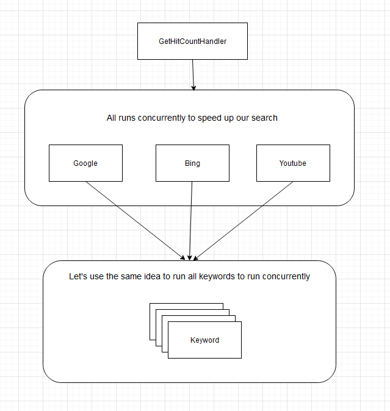
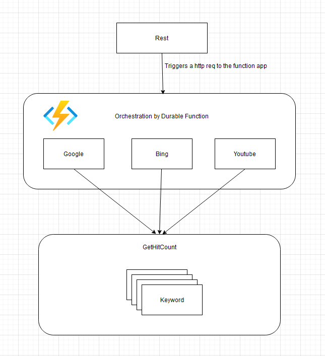

# TheHitCount
This service should make a search against two or more search engines (e.g., Google, Bing, Yahoo, Twitter, Web Search, Algolia, AltaVista…) and present the total number of search hits from each search engine. If the user enters several words, this service should make a search for each word, summarize the number of hits, and then present the sum from each search engine.

## Projects
There are 5 projects in this solution

1. **Web**: A simple website with an input field so that users can make a search.
2. **Rest**: A simple rest api that accepts post request to make a search.
3. **Core**: Implements the HitCountService. All the logics are written here.
4. **Functions**: Implements a Durable Funciton to orchestrate search for different search engines.
5. **Common**: Common dependency for the other project.

The key ideas behind this projects are -
* Seperation of concerns.
* Use concurrently running tasks to make search quicker (way 1).
* Use orchestration mechanism to make search quicker (way 2).

I used -
* Autofac framework for Dependency injection.
* SerpApi for making search to different search engines. The free api token has some limitation (100 searches only 40 left).

## How to run locally
### way 1
Run the web project. 



### way 2
Run the Rest and the funciton app projects together. The rest project has a swagger endpoint to post a request. However you need to setup, azure local storage emulator. There are severel ways (I use the option 1)

1. Start with storage on disk and restart automatically after reboot. This one uses c:\Data\azurite to store data.

``` docker run -d --restart unless-stopped -p 10000:10000 -p 10001:10001 -p 10002:10002 -v c:/Data/azurite:/data mcr.microsoft.com/azure-storage/azurite ```

2. Start without storage on disk. Data will be lost and must be restarted after reboot.

``` docker run -p 10000:10000 -p 10001:10001 mcr.microsoft.com/azure-storage/azurite ```

3. Start with storage on disk. Data will not be lost, but must be restarted after reboot. This one uses c:\Data\azurite to store data.

```  docker run -p 10000:10000 -p 10001:10001 -v c:/Data/azurite:/data mcr.microsoft.com/azure-storage/azurite ``` 



## TODO
If time permits I should add project reference 'core' to the function app project, so that we can use the SerpService inside the function app and get rid off some duplicate logic. 


